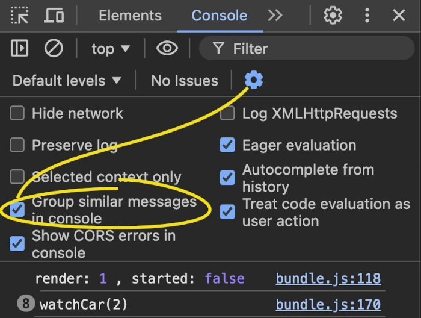

## Updating distance at regular intervals

The thing that bothers me the most about your app is how you calculate the distance travelled. I'd like to treat that now... but as you'll see there's something else that I'll need to clear up first.

### Calculating distance...

 If you run at 10 metres per second (like any good Olympic sprinter), you can cover 100 meters in 10 seconds.

> 10 metres per second * 10 seconds = 100 metres / second * second = 100 metres

How far would you travel in 100ms (or 0.1 seconds)?

> 10 metres per second * 0. seconds = 1 metre / second * second = 1 metre

Suppose your `TaskReducer.js`script knows that you are travelling at a speed of `10` (metres per second), and you ask it every 100ms, "How far have I gone now?", it could say: "Well, last time you asked, you had travelled `x` metres. Now you have had time to travel one more metre, so that should be `x + 1`."

In pseudo-code:
```code
  distanceNow = distanceAMomentAgo + (speed * timeSinceAMomentAgo)
```
To be _absolutely_ accurate, that should be `+ (averageSpeed * timeSinceAMomentAgo)`, but this is not a mission-critical application for NASA, so you can use `speed`, even when the speed is changing due to acceleration or braking. Also, any technique that you can use to ask "How far have I gone now?" will not trigger at exactly equal intervals, so `timeSinceAMomentAgo` can vary, but for this assignment, you can ignore that, too.

### ... at regular intervals

The most important thing to note is that you will need to ask your `reducer` function this question very often. At a regular interval. Can you think of a JavaScript technique for calling the same function over and over at regular intervals?

Here's a Google query: [js call function at regular intervals](https://www.google.com/search?q=js+call+function+at+regular+intervals).

When you use a React component to render a DOM element to your page, React will call your component function. Each time it calls the function, the variables inside the function will be in a different _scope_ from the last time. So here are two questions that you need to answer:

1.  How can you start calling a function repeatedly in a React component?
2. How can you ensure that the function you call is in the scope of the current function call?

Which of the hooks  `useState`, `useEffect`, `useRef` and `useContext` do you think would work best for this?

You could add something like this to your `Car` component:

```js
const watchCar = () => {
    dispatch({
      type: "WATCH_CAR",
    })
  }

  const startWatching = () => {
    setInterval(watchCar, 100)
  }

  useEffect(startWatching, [])
```
You'll also have to change the very first line of the `Car.js` script, or your browser will complain that `useEffect` in undefined:
```js
import React, { useReducer, useEffect } from "react"; // add useEffect
```
You don't have `"WATCH_CAR"` case in your `reducer` function yet, so the `default` case would be triggered, and `state` would be returned as-is. Nothing would happen yet.

### Back to the future?

Soon, I'll show you how you can create a `watchCar()` function inside your `TaskReducer.js` script, and use that to calculate how far the car has travelled. But first, I want you to discover how to get React to reveal the secrets of how `useReducer()` works.

Here are a couple of questions for you. I'll answer the first one, and I'll show you how to find the answer to the second.

1. [When will the `useEffect` be triggered?](https://dev.to/cassidoo/when-useeffect-runs-3pf3#when-does-raw-useeffect-endraw-get-called)

It will _always_ be triggered immediately after a component is rendered for the first time. If there is *no* dependency array (here the dependency array is `[]`), then it will be triggered again immediately after the component is rendered every time. If the dependency array contains a variable, it will only be called if the value of that variable changes. But here, the dependency array is empty. It contains no variables that might change. So it will never be called again.

In other words `setInterval(watchCar, 100)` will be called once, when the component is first rendered. But `watchCar` will be called every `100` milliseconds after that.

2. The `watchCar()` function that is called by `setInterval`  was created inside the scope of the first call to the `Car()` function. You then press a button or something and React calls the `Car()` function again and your `Car` component is updated. But the `Car()`function never calls `setInterval` again. So the `watchCar()` function is trapped in a scope from the past, a little like a mosquito in amber which drew blood from a dinosaur in the Jurassic Park stories.
   
   **Is this going to cause a problem?**

That was quite a complicated question, so I'll explain it in a different way. When you first learned about `useState`, you learned that [you have to be careful about using an outdated value](https://medium.com/@anandsimmy7/stale-closures-and-react-hooks-ea60689a3544) of what the state was in a previous rendering of your component. Are you going to have to deal with a similar problem here?

### Counting renders

First, can you edit the beginning of your `Car()` function, so that it looks like this:
```js
let renders = 0 // new line

const Car = () => {
  const render = ++renders // new line

  const [state, dispatch] = useReducer(reducer, initialState);
  const {
    started,
    speed,
    distance
  } = state

  console.log("render:", render, ", started:", started); // new line
 
 // Many lines skipped
}
```
What does this do?

1. _When the `Car.js` script is loaded_, the `renders` variable, which is outside the `Car()` function is set to zero. Because it is declared with `let`, the value of `renders` can be changed later.
2. _Each time _ the `Car()function is called`_ the `const render`, which is inside the scope of the `Car()` function will:
	* Read the current value of `renders`
	* Add `1` to this value, so that the value of `renders` itself changes
	* Adopt the new value of `renders`
	
   Note that the `const render` cannot be changed, because it is declared as a `const`.
3. The `console.log(...)` command will print out something in your browser's Console.

Open your app in your browser, open the Developer Tools at the Console tab, and look at what it says. Click on the Turn Engine On button, and then on the Turn Engine Off button. At each render, you should see a message. Here's what I see:
```console
render: 1 , started: false
render: 3 , started: true
render: 5 , started: false
```
### Why such odd numbers?

 Perhaps you are wondering why the numbers jump by `2` each time. The reason is because your app is running in development mode, and `React.StrictMode` is activated.

`React.StrictMode` is designed to help you make sure that your `useEffect()` functions clean up properly after themselves. You can find more about it [here](https://react.dev/reference/react/StrictMode).

You can switch it off by editing the file at `src/index.js`. Here's what it looks like now:
```js
import React from "react";
import ReactDOM from "react-dom";
import App from "./App";

ReactDOM.render(
  <React.StrictMode>
    <App />
  </React.StrictMode>,
  document.getElementById("root")
);
```
You can comment out the lines with `<React.StrictMode>` and `</React.StrictMode>`, but be sure to leave the comma before the line `document.getElementById("root")`:
 
 ```js
import React from "react";
import ReactDOM from "react-dom";
import App from "./App";

ReactDOM.render(
  // <React.StrictMode>
    <App />
  // </React.StrictMode>
  ,
  document.getElementById("root")
);

```
Now, if you refresh your page, and click on the Turn Engine On button, and then on the Turn Engine Off button, here's what you should see:
```console
   render: 1 , started: false
   render: 2 , started: true
   render: 3 , started: false
```
Now that you understand why you are seeing only odd numbers for `render`, you can revert your  file at `src/index.js`, to turn `React.StrictMode` back on. It's there to help you. In the log extracts that follow, you'll see the output that I get with `React.StrictMode` back on.

### Unstuck in time

To see which render was active when `startWatching` was called by `useEffect`, add this code to your `Car()` function:

```js
  const watchCar = setBy => {
    console.log(`watchCar(${setBy})`)
        
    dispatch({
      type: "WATCH_CAR",
      payload: setBy
    })
  }

  const startWatching = () => {
    const interval = setInterval(watchCar, 1000, render)

    return () => {
      console.log(`Cleaning up startWatching (render: ${render})`)
      clearInterval(interval)
    }
  }

  useEffect(startWatching, [])
```

Points to note:
* I've used `1000` milliseconds as the interval in `setInterval(watchCar, 1000, render)`, so that the logging in your browser doesn't go crazy
* I've added `render` as [the third argument for `setInterval()`](https://developer.mozilla.org/en-US/docs/Web/API/setInterval#arg1). The first argument should be a function (here `watchCar`), the second should be the millisecond delay between each time the function is called, and any subsequent arguments are sent as arguments to the function call.
* The `watchCar()` function uses a `setBy` parameter. This will have the value that `render` had when `setInterval()` was invoked.
* The `watchCar()` function logs its name and the value of `setBy` to the console, each time it is called
* The call to `dispatch` doesn't do anything useful yet, as I described earlier.

What do you see in your browser console? In my browser, I see that `watchCar(2)` is logged, with a counter in front of it to say how many times this message was logged:

```console
   render: 1 , started: false
8  watchCar(2)
```

If you see something different, you can click on the Settings button in the Console and select the Group Similar Messages checkbox.


To stop these messages from being logged, you can comment out the line that logs them:
```js
  const watchCar = setBy => {
    // console.log(`watchCar(${setBy})`)
        
    dispatch({
      type: "WATCH_CAR",
      payload: setBy
    })
  }
```

This will force VS Code to recompile your web page, and your browser should now tell you that the clean-up function returned by `startWatching()` has been triggered. I did this while the React page was active in my browser, and here's what the Console showed me:
```console
   render: 1 , started: false
9  watchCar(2)
   render: 1 , started: false
   Cleaning up startWatching (render: 2)
   render: 3 , started: false
```

### So why `render 2`?

In `React.StrictMode`, React calls the component function twice for each render. It never actually renders the first call; it just runs through the motions. The `useEffect` function is not triggered until the component is actually rendered on the second call React makes. So: on `render 2`.

### Which `render` scope is the `dispatch` function in?

If `watchCar()` is constantly being called from the scope of a function that performed a render in the past, won't that put the call to `dispatch()` in the same scope. How can you check that?

You can ask the `reducer()` function to tell you. In your `TaskReducer.js` script, add a new case to the `reducer()` function, and add a new `watchCar()` function. Add a new `called` state to the `initialState` object:

```js
export function reducer(state, action) {
    const { type, payload } = action

    switch(type){
        // Existing cases skipped
        
        case "WATCH_CAR": // new case
            return watchCar(state, payload);
    }
}

// Existing functions skipped

function watchCar(state, setBy) { // new function
    const called = state.called + 1;
    return { ...state, setBy, called }
}

export const initialState = {
      started: false,
      speed: 0,
      distance: 0,
      called: 0  // new state
};
```
Notice what the `watchCar()` function does here. It reads the value of `called` from its own current `state`, adds `1` to it, and returns a new object which is a clone of the earlier `state`, but with a new value of `called` and the value of `setBy` that was set in the call to `dispatch()`

In your `Car.js` script, edit the beginning of your `Car()` function:
```js
let renders = 0

const Car = () => {
  const render = ++renders

  const [state, dispatch] = useReducer(reducer, initialState);
  const {
    started,
    speed,
    distance,
    setBy,
    called
  } = state

  console.log("render:", render, ", setBy:", setBy, ", called:", called);

  // The rest of the code is the same as before
}
```
Refresh the page in your browser, and look at what is printed in the Console now. Here's what I see:
```console
render: 1 , setBy: undefined , called: 0
render: 3 , setBy: 2 , called: 1
render: 5 , setBy: 2 , called: 2
render: 7 , setBy: 2 , called: 3
render: 9 , setBy: 2 , called: 4
```
You didn't include a `setBy` property in the `initialState` object, so the first time the `Car()` function is called, `state.setBy` is `undefined`.  After that, it is always set to `2`, which is what you would expect, because `setInterval()` was invoked during the second call to the `Car()` function.

The key point to note is that `called` has increased by 1 each time the `console.log()` call is executed. What does this mean? This means that _it is the same `dispatch()` function that is called each time_. Specifically:

**The problem with stale values that you can get with `useState` does not occur with `useReducer`.**

### How is `useReducer` different from `useState`?

The way you set up `useState` and `useReducer` look very similar. Both call a React method, both receive an array containing two values as the output:
```js
  const [ value, setValue ] = useState(initialValue)
  const [ state, dispatch ] = useReducer(reducer, initialState);
```
The key difference is that`useReducer` requires you to send a  _function_ (called `reducer` in the example above) as one of the arguments. The `useState` hook does not. The `useState` hook does _allow_ you to [use an updater function when you call it with an update](https://react.dev/reference/react/useState#updating-state-based-on-the-previous-state#updating-state-based-on-the-previous-state), but it does not _require_ you to do this. If you don't use an updater function, you may have problems with stale values.

The `useReducer` hook _forces_ you to call an updater function. Indeed, it forces you to declare the updater function that you want it to call, before you can even start using `useReducer()`.

Because of this, `useReducer` will always provide the latest value of `state` to your component function, even if the call to the `dispatch` function comes from a scope that is no longer used for the current render.

### Take-aways from this section

Here's what I hope you have learned on this side track:

1. You can provide arguments for the functions called by `setInterval` and `setTimeout`. 
2. Using `setInterval` or `setTimeout` in a React component can be a source of headaches.
3. If you use `useEffect` you should clean up afterwards.
4. `React.StrictMode` is designed to encourage you to do this.
5. The `useReducer` hook is inherently more robust than `useState`, especially when used in combination with `useEffect`.
6. Adding a `payload` to a `dispatch` action object allows you to provide arguments for your `reducer` function to work with

And more importantly, in the long term:

7. It is possible to write code that makes the code engine show you how it works internally. Whenever you find that your code is not doing what you expected it to do, you can create a new branch in Git and write some experimental code that you can delete later, after you have learned from it.

An alternative approach might be to ask ChatGPT a question when you run into a problem. The difficulty there is knowing what question to ask. I found that the following question prompted ChatGPT to give a good answer to the problem that I have just described. Perhaps it will give you a useful answer too.

>In React, the useEffect hook can provide stale data. Is this a problem with useReducer?

However, I think that when you experimental code yourself, you will understand both the problems and the solutions more clearly than if you ask a person, or Google, or ChatGPT for an explanation. So, even if you _do_ ask for help, you should _also_ write some code that demonstrates the understanding that you have just acquired.

### Back on (the race) track

Now run `git checkout 03-calculating-distance` 
